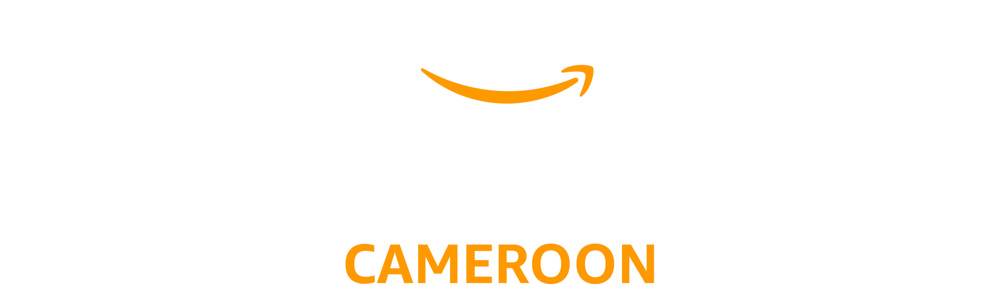

# AWS Community Day Cameroon

<div align="center">
  
</div>

Official website for AWS Community Day Cameroon - a community-driven event bringing together AWS enthusiasts, developers, and cloud professionals in Cameroon.

## About

AWS Community Day Cameroon is an annual event organized by AWS User Groups in Douala, Yaounde, and AWS Cloud Clubs UBa. The event features:

- Keynote speakers from AWS and the local tech community
- Technical sessions on cloud computing and AWS services
- Networking opportunities with fellow cloud enthusiasts
- Sponsor exhibitions and community showcases

## Tech Stack

- **Framework**: Nuxt 3
- **Language**: TypeScript
- **Styling**: CSS with Bootstrap
- **Internationalization**: Vue i18n (English/French)
- **Deployment**: AWS Amplify

## Setup

Install dependencies:

```bash
npm install
# or
yarn install
```

## Development

Start the development server:

```bash
npm run dev
# or
yarn dev
```

The site will be available at `http://localhost:3000`

## Build

Build for production:

```bash
npm run build
# or
yarn build
```

Preview production build:

```bash
npm run preview
# or
yarn preview
```

## Project Structure

- `/pages` - Vue pages for different routes (2024/2025 editions)
- `/components` - Reusable Vue components
- `/data` - Speaker and organizer data
- `/locales` - Internationalization files (EN/FR)
- `/public` - Static assets (images, sponsors, etc.)
- `/assets` - CSS and other assets

## Contributing

This project is maintained by the AWS User Groups in Cameroon. For updates or contributions, please contact the organizers.

## Links

- [AWS User Group Douala](https://www.meetup.com/awsugdouala)
- [AWS User Group Yaounde](https://www.meetup.com/aws-user-group-yaounde)
- [AWS Cloud Clubs UBa](https://www.meetup.com/aws-cloud-club-at-the-university-of-bamenda)